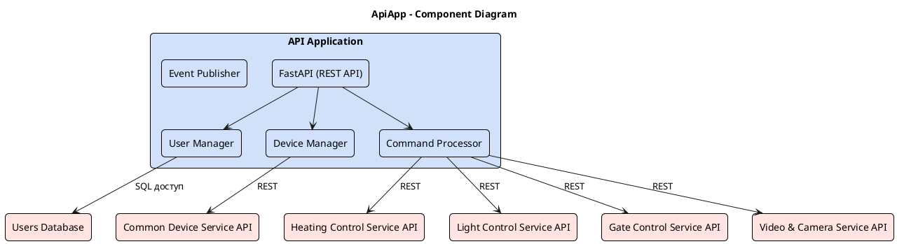

# Project_template


# Задание 1. Анализ и планирование

<aside>

Чтобы составить документ с описанием текущей архитектуры приложения, можно часть информации взять из описания компании и условия задания. Это нормально.

</aside>

### 1. Описание функциональности монолитного приложения


Нынешнее приложение компании позволяет только управлять отоплением в доме и проверять температуру.
Каждая установка сопровождается выездом специалиста по подключению системы отопления в доме к текущей версии системы.


**Управление отоплением:**

- Пользователи могут удалённо включать/выключать отопление в своих домах через веб-интерфейс.
- Специалисты по поддержке могут подключать новые модули управления отоплением. Самостоятельно подключить свой датчик к системе обычный пользователь не может 
- Система поддерживает включение/выключение отопления через веб интерфейс 
- Система поддерживает подключение новых модулей для управления отоплением. Каждая установка сопровождается выездом специалиста по подключению системы отопления в доме к текущей версии системы

**Мониторинг температуры:**

- Пользователи могут просматривать текущую температуру в своих домах через веб-интерфейс.
- Система поддерживает получение данных о температуре с датчиков, установленных в домах. Данные о температуре обновляются по запросу от сервера

### 2. Анализ архитектуры монолитного приложения

Перечислите здесь основные особенности текущего приложения: какой язык программирования используется, какая база данных, как организовано взаимодействие между компонентами и так далее.

Архитектура приложения представляет из себя монолит:
- Архитектура монолитная, все компоненты системы (обработка запросов, бизнес-логика, работа с данными) находятся в рамках одного приложения.
- Масштабируемость ограничена, так как монолит сложно масштабировать по частям
- Развертывание требует остановки всего приложения.
- Язык программирования Go  
- СУБД Postgres 
- Все взаимодействия синхронные, запросы обрабатываются последовательно. Никаких асинхронных вызовов и реактивного взаимодействия в системе нет. 
- Управление идёт от сервера к датчику 
- Данные о температуре получаются через запрос от сервера к датчику

### 3. Определение доменов и границы контекстов

Опишите здесь домены, которые вы выделили.

- Домен "Управление отоплением": это основной домен, который компания уже предоставляет и он остается важной частью новой экосистемы
	- Поддомен "Управление отоплением" 
		- Контекст "Управление устройствами отопления": отвечает за управление физическими устройствами отопления (котлы, радиаторы, теплые полы). Включение/выключение, установка температуры, получение информации о состоянии устройства.
	- Поддомен "Мониторинг температуры": Собирает и хранит данные о температуре с датчиков. Функции: получение данных с датчиков, агрегация данных.
		- Контекст "сбор и предоставление данных о температуре" 
- Домен "Управление освещением": позволяет пользователям контролировать освещение в доме, что является стандартной функцией умного дома.
	- Поддомен "Управление устройствами освещения"
		- Контекст "управление устройством освещения": включение выключения освещения, проверка состояния освещения
	- Поддомен "Управление группами освещения" (комнаты и уличное освещение)
		- Контекст "управление группой освещения": включение выключения группы освещения, проверка состояния группы освещения
- Домен "Управление воротами": обеспечивает удаленное управление воротами, добавляя безопасность 
	- Поддомен "Управление устройствами ворот" 
		- Контекст "управление состоянием ворот"(открытие/закрытие)
	- Поддомен "Мониторинг состояния ворот"
		- Контекст "мониторинг состояния ворот и сигнализация": мониторинг состояния ворот и отправка уведомлений о любых подозрительных событиях
- Домен "Наблюдение": позволяет пользователям удаленно наблюдать за своим домом, повышая безопасность и контроль. 
	- Поддомен "Управление камерами"
		- Контекст "настройка камер"
	- Подомен "Просмотр камер" 
		- Контекст "просмотр видео с камер"
	- Поддомен "Запись видео"
		- Контекст "управление видеоархивом": запись видео, хранение архива и предоставление доступа к записям
	- Подомен "Детекция событий"
		- Контекст "детекция событий и уведомления": анализ видеопотока, обнаружение событий и отправка уведомлений пользователю
- Домен "Администрирование"
	- Подомен "Управление пользователями"
		- Контекст "управление пользователями и доступом к устройствам"
	- Подомен "Подключение устройств"  
		- Контекст "подключение новых устройств": подключение новых устройств, которые поддерживаются платформой

Домен "Управление отоплением" - это существующее решение, которое будет подвергнуто рефакторингу и разделено на микросервисы. Эта подсистема станет первым релизом после рефакторинга, что позволит команде разработчиков быстро получить представление о функционировании микросервисной архитектуры и оперативно внести необходимые изменения в процесс разработки. Станет понятно, как лучше масштабировать эту и другие подсистемы в контексте микросервисной архитектуры и можно будет оперативно скорректировать стратегию. Масштабирование может отличаться от других доменов.

### **4. Проблемы монолитного решения**

- Ограниченная масштабируемость, потому что монолит сложно масштабировать по частям. Это значит что существующая система просто не справиться с нагрузкой при увеличении количества подключённых домов.  
- Сбой в одной части системы ведёт к остановке всей системы
- Обновление требует остановки всей системы
- Добавление новой функциональности со временем станет просто невозможным, а релизы будут выпускаться очень долго и тяжело тестироваться.  
- Невозможно привлечь несколько команд для разработки из-за того что кодовая база одна и система очень сильно связана на уровне компонентов и кода. 

### 5. Визуализация контекста системы — диаграмма С4

Добавьте сюда диаграмму контекста в модели C4.

Диаграмма контекста C4 для исходного монолита:

```puml

@startuml
title Warmhouse Context Diagram

top to bottom direction

!includeurl https://raw.githubusercontent.com/RicardoNiepel/C4-PlantUML/master/C4_Component.puml

Person(user1, "User", "Жители домов")

System(WarmhouseSystem, "Warmhouse System", "Отопление, освещение, ворота, наблюдение")
System(WarmSystem, "Устройства отопления", "Котлы, радиаторы, теплые полы")

Rel(user1, WarmhouseSystem, "Использует систему")
Rel(WarmhouseSystem, WarmSystem, "Управление и получение данных")

@enduml

```

Диаграмма контекста C4 для нового решения:

```puml

@startuml
title Warmhouse Context Diagram

top to bottom direction

!includeurl https://raw.githubusercontent.com/RicardoNiepel/C4-PlantUML/master/C4_Component.puml

Person(user1, "User", "Жители домов")

System(WarmhouseSystem, "Warmhouse System", "Отопление, освещение, ворота, наблюдение")
System(WarmSystem, "Устройства отопления", "Котлы, радиаторы, теплые полы")
System(GatesSystem, "Ворота", "")
System(LightSystem, "Освещение", "")
System(VideoSystem, "Наблюдение", "")

Rel(user1, WarmhouseSystem, "Использует систему")
Rel(WarmhouseSystem, WarmSystem, "Управление и получение данных")
Rel(WarmhouseSystem, GatesSystem, "Управление и получение данных")
Rel(WarmhouseSystem, LightSystem, "Управление и получение данных")
Rel(WarmhouseSystem, VideoSystem, "Управление и получение данных")

@enduml

```

# Задание 2. Проектирование микросервисной архитектуры

В этом задании вам нужно предоставить только диаграммы в модели C4. Мы не просим вас отдельно описывать получившиеся микросервисы и то, как вы определили взаимодействия между компонентами To-Be системы. Если вы правильно подготовите диаграммы C4, они и так это покажут.

**Диаграмма контейнеров (Containers)**

```puml

@startuml
title Warmhouse Container Diagram

top to bottom direction

!includeurl https://raw.githubusercontent.com/RicardoNiepel/C4-PlantUML/master/C4_Container.puml

Person(user, "User", "Пользователь системы Умный дом")
System(WarmhouseSystem, "Warmhouse System", "Отопление, освещение, ворота, наблюдение")

Container_Boundary(WarmhouseSystem, "FitLife System") {
  Container(ApiApp, "API Application (IPI)", "Python, Fast API", "Обрабатывает пользовательские запросы, управление пользователями и устройствами")
  
  Container(HeatingControlService, "Heating control service", "Python", "Управление отоплением")
  Container(TemperatureMonitoringService, "Temperature monitoring service", "Python", "Мониторинг температуры")
  Container(TemperatureDatabase, "Monitoring database", "PostgreSQL/TimescaleDB", "Хранит данные мониторинга температуры")
  
  Container(LightControlService, "Light control service", "Python", "Управление освещением")
  
  Container(GateControlService, "Gate control service", "Python", "Управление воротами")
  Container(GateMonitoringService, "Gate monitoring service", "Python", "Отслеживание состояния ворот")
  
  Container(VideoCameraService, "Video and Camera Service", "Python", "Управление видеоархивом, просмотр камер и детекция движения")
  Container(VideoDatabase, "Video database", "PostgreSQL", "Хранит видео и информацию о движении")
  
  Container(UsersDatabase, "Users database", "PostgreSQL", "Хранение данных о пользователях")
  Container(CommonDeviceService, "Common device service", "Python", "Регистрация/удаление/активация/деактивация устройств. Получение списка устройств для пользователя")
  Container(DeviceCatalogDatabase, "DeviceCatalog database", "PostgreSQL", "Хранит данные о подключенных устройствах, а также их настройки")

}

System(HeatingModuleSystem, "Heating module", "Модуль управления отоплением")
System(LightControlModule, "Light control module", "Модуль управления освещением")
System(GateModule, "Gate module", "Модуль управления воротами")
System(CameraModule, "Camera module", "Модуль работы с камерами")

Rel(user, ApiApp, "Uses the system")

Rel(ApiApp, HeatingControlService, "Управление отоплением и запрос телеметрии")
Rel(ApiApp, LightControlService, "Управляет освещением")
Rel(ApiApp, GateControlService, "Управляет воротами")
Rel(ApiApp, VideoCameraService, "Управляет и получает данные наблюдения")

Rel(ApiApp, GateMonitoringService, "Следит за состоянием ворот")
Rel(ApiApp, TemperatureMonitoringService, "Настройка мониторинга и получение данных мониторинга")

Rel(ApiApp, UsersDatabase, "Управление пользователями и хранение данных")
Rel(ApiApp, CommonDeviceService, "Регистрация и управление устройствами")
Rel(CommonDeviceService, DeviceCatalogDatabase, "Чтение и запись данных устройств")

Rel(LightControlService, LightControlModule, "Управляет модулем освещения")

Rel(GateControlService, GateModule, "Управляет модулем ворот")
Rel(GateMonitoringService, GateModule, "Проверяет ворота")

Rel(VideoCameraService, VideoDatabase, "Запись и чтение видео и данных детекции движения")
Rel(VideoCameraService, CameraModule, "Получение видео с камеры в реальном времени и анализ")

Rel(HeatingControlService, HeatingModuleSystem, "Управляет")
Rel(TemperatureMonitoringService, TemperatureDatabase, "Сохранение и предоставление данных мониторинга")
Rel(TemperatureMonitoringService, HeatingModuleSystem, "Получает данные мониторинга")

' Доступ к каталогу устройств для всех сервисов
Rel(ApiApp, CommonDeviceService, "Доступ к каталогу устройств")
Rel(HeatingControlService, CommonDeviceService, "Доступ к каталогу устройств")
Rel(LightControlService, CommonDeviceService, "Доступ к каталогу устройств")
Rel(GateControlService, CommonDeviceService, "Доступ к каталогу устройств")
Rel(VideoCameraService, CommonDeviceService, "Доступ к каталогу устройств")
Rel(GateMonitoringService, CommonDeviceService, "Доступ к каталогу устройств")
Rel(TemperatureMonitoringService, CommonDeviceService, "Доступ к каталогу устройств")

@enduml

```

**Диаграмма компонентов (Components)**

Добавьте диаграмму для каждого из выделенных микросервисов.




```puml


```


```puml


```


```puml


```


```puml


```


```puml


```


```puml


```


```puml


```

**Диаграмма кода (Code)**

Добавьте одну диаграмму или несколько.

# Задание 3. Разработка ER-диаграммы

Добавьте сюда ER-диаграмму. Она должна отражать ключевые сущности системы, их атрибуты и тип связей между ними.

# Задание 4. Создание и документирование API

### 1. Тип API

Укажите, какой тип API вы будете использовать для взаимодействия микросервисов. Объясните своё решение.

### 2. Документация API

Здесь приложите ссылки на документацию API для микросервисов, которые вы спроектировали в первой части проектной работы. Для документирования используйте Swagger/OpenAPI или AsyncAPI.

# Задание 5. Работа с docker и docker-compose

Перейдите в apps.

Там находится приложение-монолит для работы с датчиками температуры. В README.md описано как запустить решение.

Вам нужно:

1) сделать простое приложение temperature-api на любом удобном для вас языке программирования, которое при запросе /temperature?location= будет отдавать рандомное значение температуры.

Locations - название комнаты, sensorId - идентификатор названия комнаты

```
	// If no location is provided, use a default based on sensor ID
	if location == "" {
		switch sensorID {
		case "1":
			location = "Living Room"
		case "2":
			location = "Bedroom"
		case "3":
			location = "Kitchen"
		default:
			location = "Unknown"
		}
	}

	// If no sensor ID is provided, generate one based on location
	if sensorID == "" {
		switch location {
		case "Living Room":
			sensorID = "1"
		case "Bedroom":
			sensorID = "2"
		case "Kitchen":
			sensorID = "3"
		default:
			sensorID = "0"
		}
	}
```

2) Приложение следует упаковать в Docker и добавить в docker-compose. Порт по умолчанию должен быть 8081

3) Кроме того для smart_home приложения требуется база данных - добавьте в docker-compose файл настройки для запуска postgres с указанием скрипта инициализации ./smart_home/init.sql

Для проверки можно использовать Postman коллекцию smarthome-api.postman_collection.json и вызвать:

- Create Sensor
- Get All Sensors

Должно при каждом вызове отображаться разное значение температуры

Ревьюер будет проверять точно так же.


